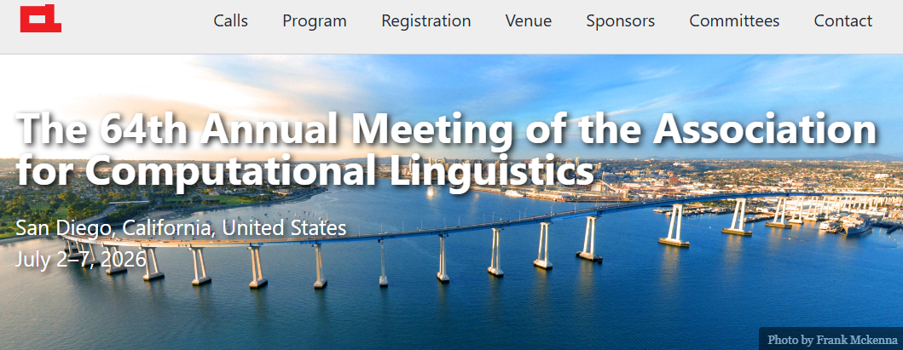

Honored to serve as an **Area Chair** (OpenReview) for **ACL 2026** — the 64th Annual Meeting of the Association for Computational Linguistics, taking place **July 7–12, 2026** in San Diego, California, United States.

ACL is the premier international conference in computational linguistics and natural language processing, and it's a privilege to contribute to the peer review process for this year's program.

Learn more: [ACL 2026](https://2026.aclweb.org/)

