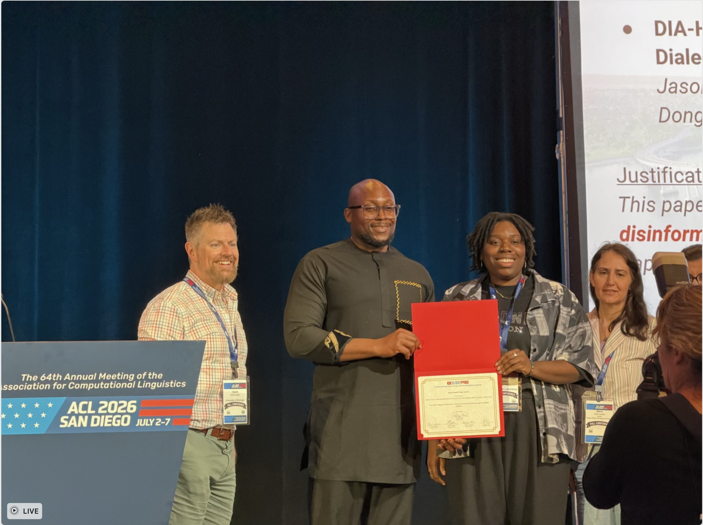

Honored and humbled to share that our paper **DIA-HARM: Dialectal Disparities in Harmful Content Detection Across 50 English Dialects** received the **🏆 Social Impact Paper Award** at the **64th Annual Meeting of the Association for Computational Linguistics (ACL 2026)** in San Diego, July 2–7, 2026.

The award recognizes work that meaningfully advances the field's positive impact on society — a mission that sits at the heart of DIA-HARM. Current harmful-content detectors are built and evaluated almost exclusively on Standard American English, systematically disadvantaging **hundreds of millions of non-SAE speakers worldwide**. By benchmarking 16 models across **50 English dialects** (U.S., British, African, Caribbean, and Asia-Pacific varieties) using the **D3 corpus** of 195K samples, we surfaced concrete equity gaps in content moderation — and gave the community a shared instrument to close them.

Deepest thanks to my incredible coauthors — **Matt Murtagh-White, Ali Al-Lawati, Uchendu Uchendu, Adaku Uchendu**, and my advisor **Dr. Dongwon Lee** — and to our collaborators at Penn State, MIT Lincoln Laboratory, and University College Dublin. And thank you to the ACL 2026 award committee for recognizing this line of work.

This award belongs equally to the linguistic communities whose voices are too often overlooked by AI systems. There is much more to do.

Resources:
- [Publication page](/publication/conference-paper-dia-harm/)
- [arXiv Paper](https://arxiv.org/abs/2604.05318)
- [Project Page](https://jsl5710.github.io/dia-harm)
- [GitHub Repository](https://github.com/jsl5710/dia-harm)
